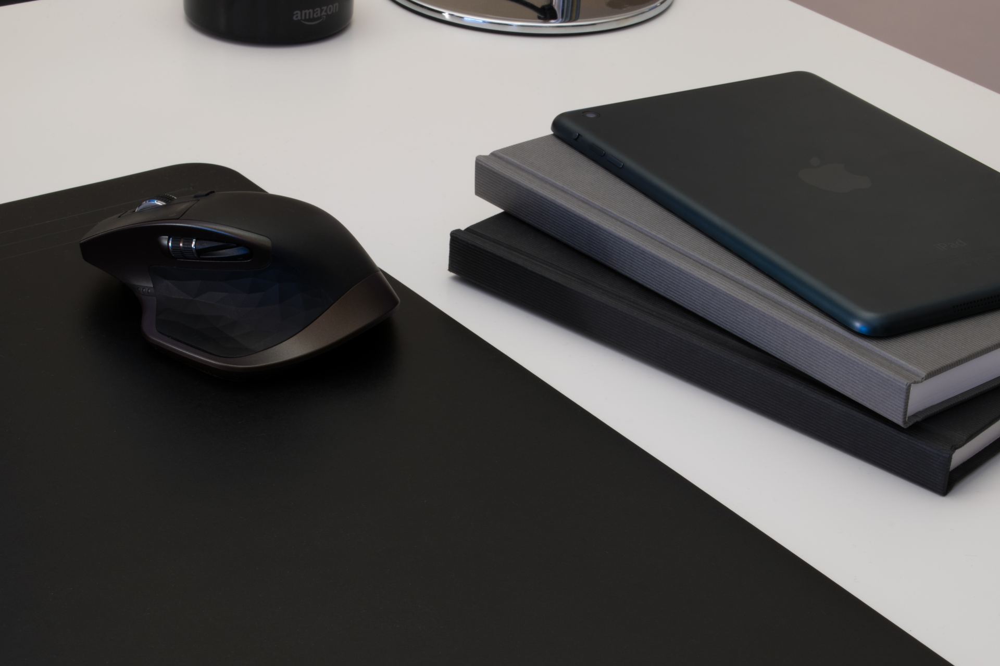

<!-- more -->

## Household names

These apps need no introduction. They're the ones that everybody knows about.

### Apple Notes

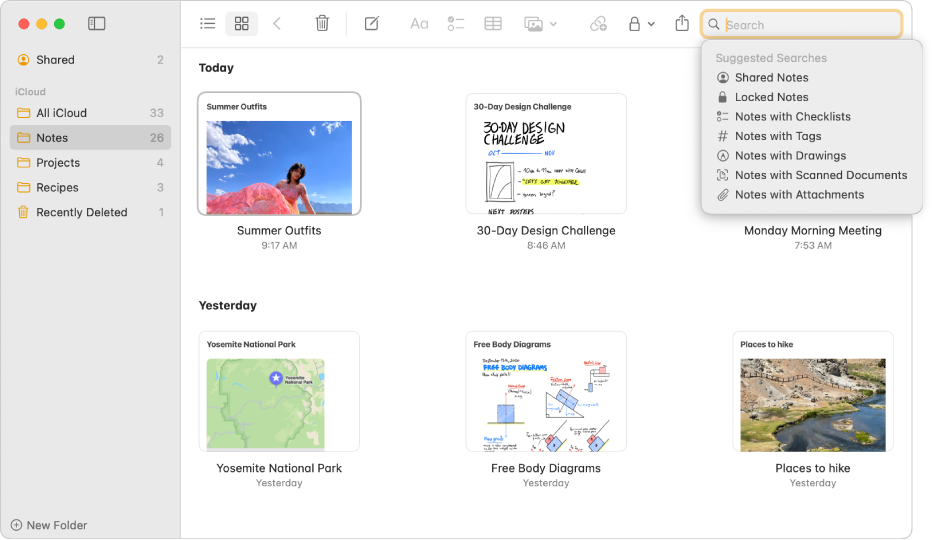{ loading=lazy }

| Criteria     | Value              | Notes |
| ------------ | ------------------ | ----- |
| Sync service | :white_check_mark: |       |
| Linux client | :x:                |       |
| Web client   | :white_check_mark: |       |
| iOS client   | :white_check_mark: |       |

### Evernote

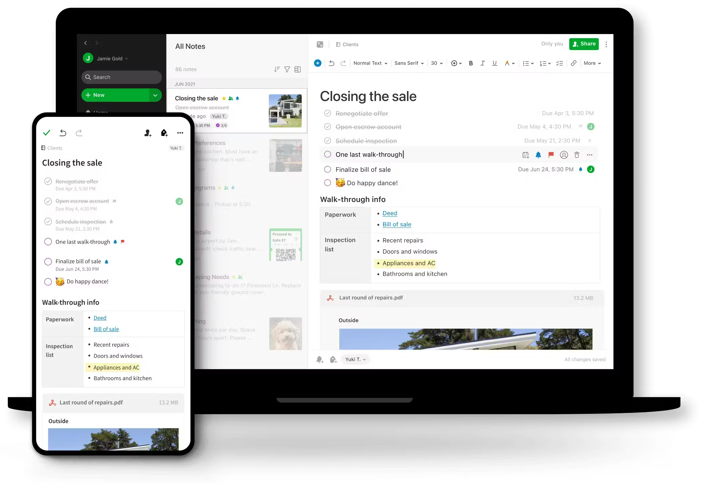{ loading=lazy }

| Criteria     | Value              | Notes                                              |
| ------------ | ------------------ | -------------------------------------------------- |
| Sync service | :white_check_mark: |                                                    |
| Linux client | :question:         | In private beta, minimal details available online. |
| Web client   | :white_check_mark: |                                                    |
| iOS client   | :white_check_mark: |                                                    |

### Google Keep

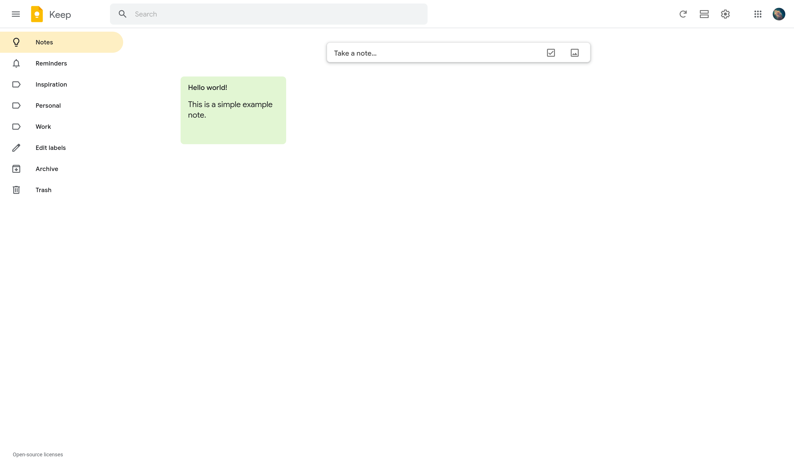{ loading=lazy }

| Criteria     | Value              | Notes |
| ------------ | ------------------ | ----- |
| Sync service | :white_check_mark: |       |
| Linux client | :x:                |       |
| Web client   | :white_check_mark: |       |
| iOS client   | :white_check_mark: |       |

### Notion

{ loading=lazy }

| Criteria     | Value              | Notes |
| ------------ | ------------------ | ----- |
| Sync service | :white_check_mark: |       |
| Linux client | :x:                |       |
| Web client   | :white_check_mark: |       |
| iOS client   | :white_check_mark: |       |

### OneNote

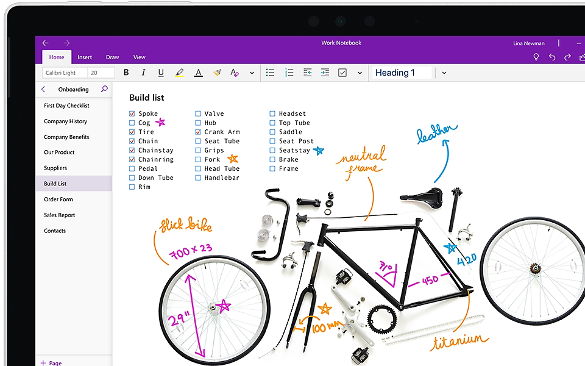{ loading=lazy }

| Criteria     | Value              | Notes                                                                                                                             |
| ------------ | ------------------ | --------------------------------------------------------------------------------------------------------------------------------- |
| Sync service | :white_check_mark: |                                                                                                                                   |
| Linux client | :x:                |                                                                                                                                   |
| Web client   | :question:         | There was for sure a web client a few years ago, however I'm having trouble navigating the docs to figure out if it still exists. |
| iOS client   | :white_check_mark: |                                                                                                                                   |

## Handwritten / canvas-based

These apps are more graphical-focused than what I'm looking for. They either focus on handwriting, or on a canvas-based approach to note-taking, which eliminates them basically immediately.

### GoodNotes

{ loading=lazy }

| Criteria     | Value              | Notes |
| ------------ | ------------------ | ----- |
| Sync service | :white_check_mark: |       |
| Linux client | :x:                |       |
| Web client   | :x:                |       |
| iOS client   | :white_check_mark: |       |

### Milanote

{ loading=lazy }

| Criteria     | Value              | Notes |
| ------------ | ------------------ | ----- |
| Sync service | :white_check_mark: |       |
| Linux client | :x:                |       |
| Web client   | :white_check_mark: |       |
| iOS client   | :white_check_mark: |       |

### Notability

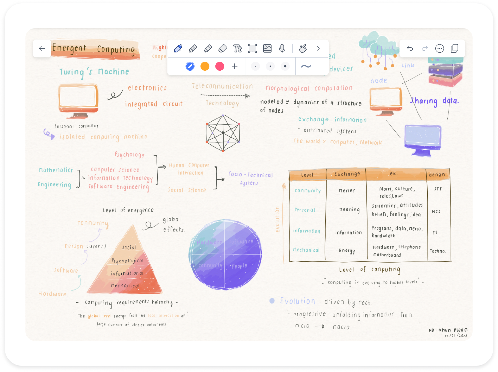{ loading=lazy }

| Criteria     | Value              | Notes |
| ------------ | ------------------ | ----- |
| Sync service | :white_check_mark: |       |
| Linux client | :x:                |       |
| Web client   | :x:                |       |
| iOS client   | :white_check_mark: |       |

### Scrintal

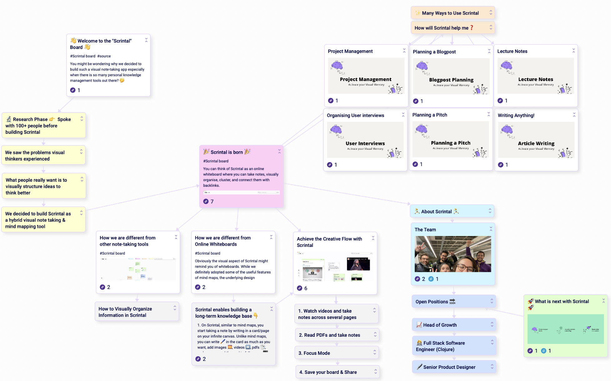{ loading=lazy }

| Criteria     | Value              | Notes |
| ------------ | ------------------ | ----- |
| Sync service | :white_check_mark: |       |
| Linux client | :x:                |       |
| Web client   | :white_check_mark: |       |
| iOS client   | :x:                |       |

## How did we get here

I will readily admit - I have absolutely zero memory of where I sourced / collected this list of note apps from. As a result, there are some items on this list that make absolutely _zero_ sense to me. Those items are these, which are all mostly to-do / task scheduling apps.

### Asana

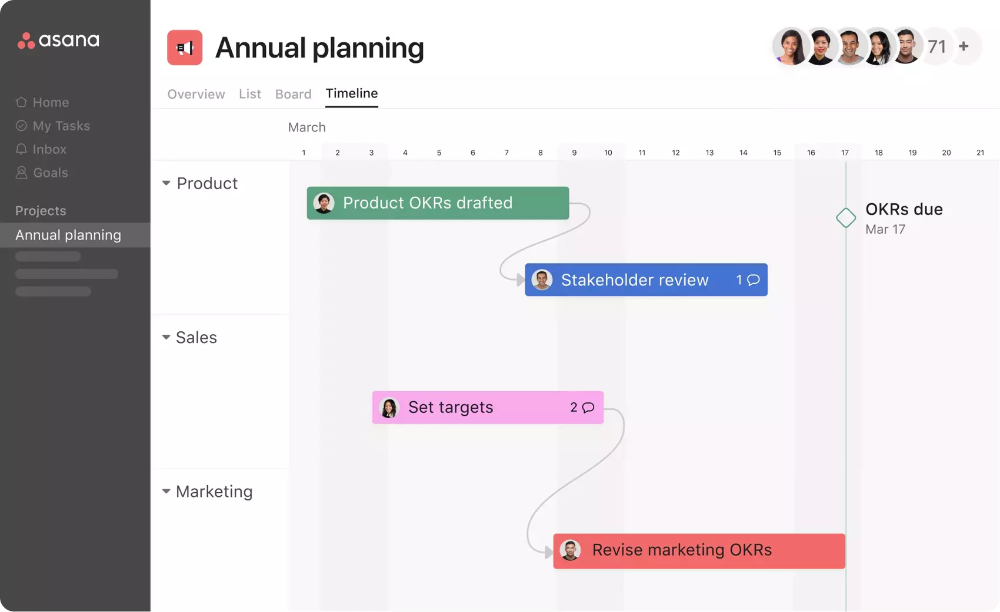{ loading=lazy }

| Criteria     | Value              | Notes |
| ------------ | ------------------ | ----- |
| Sync service | :white_check_mark: |       |
| Linux client | :x:                |       |
| Web client   | :white_check_mark: |       |
| iOS client   | :white_check_mark: |       |

### ClickUp

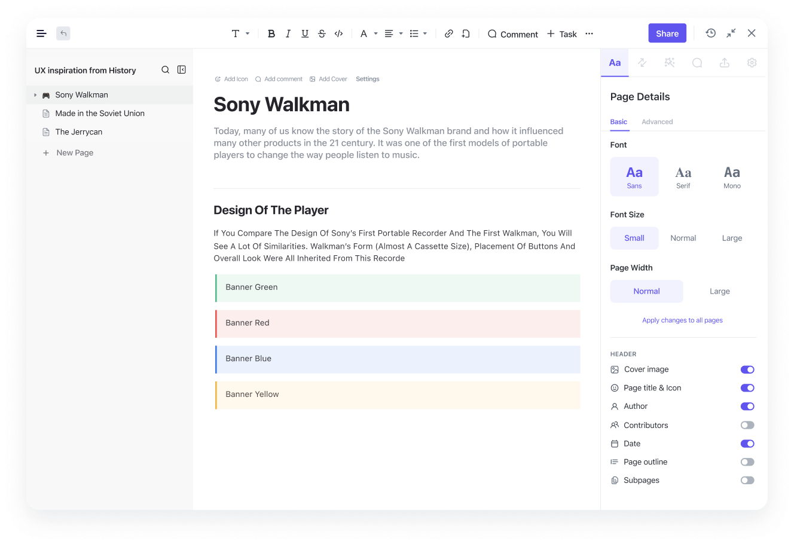{ loading=lazy }

| Criteria     | Value              | Notes |
| ------------ | ------------------ | ----- |
| Sync service | :white_check_mark: |       |
| Linux client | :white_check_mark: |       |
| Web client   | :white_check_mark: |       |
| iOS client   | :white_check_mark: |       |

### Clutter

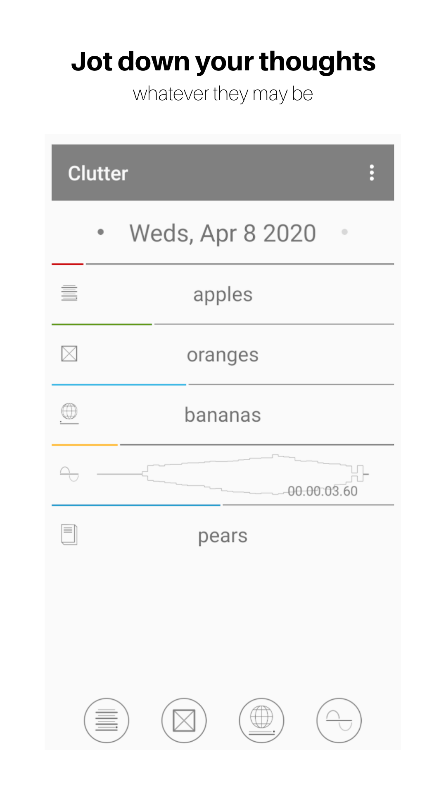{ loading=lazy width=400 }

| Criteria     | Value | Notes |
| ------------ | ----- | ----- |
| Sync service | :x:   |       |
| Linux client | :x:   |       |
| Web client   | :x:   |       |
| iOS client   | :x:   |       |

<figure markdown>
  { loading=lazy }
  <figcaption>Clutter Notes site</figcaption>
</figure>

### OmniFocus

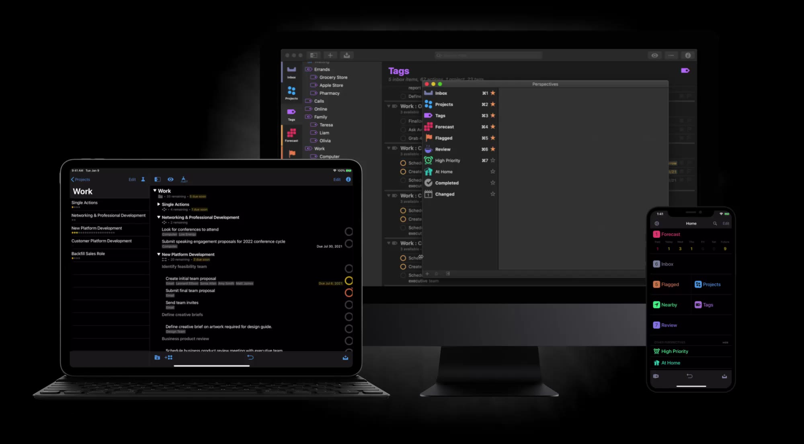{ loading=lazy }

| Criteria     | Value              | Notes |
| ------------ | ------------------ | ----- |
| Sync service | :white_check_mark: |       |
| Linux client | :x:                |       |
| Web client   | :white_check_mark: |       |
| iOS client   | :white_check_mark: |       |

### Things

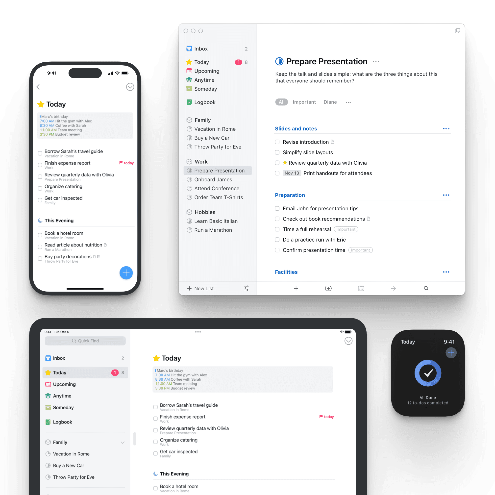{ loading=lazy }

| Criteria     | Value              | Notes |
| ------------ | ------------------ | ----- |
| Sync service | :white_check_mark: |       |
| Linux client | :x:                |       |
| Web client   | :x:                |       |
| iOS client   | :white_check_mark: |       |

## Notion clones

### Anytype

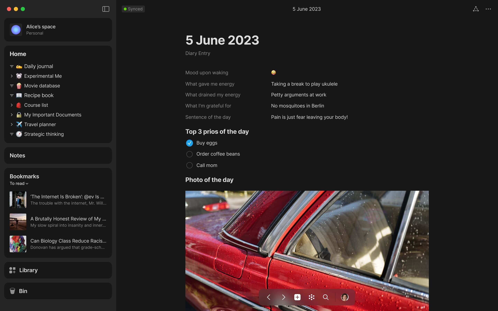{ loading=lazy }

| Criteria     | Value              | Notes |
| ------------ | ------------------ | ----- |
| Sync service | :white_check_mark: |       |
| Linux client | :white_check_mark: |       |
| Web client   | :x:                |       |
| iOS client   | :white_check_mark: |       |

### Coda

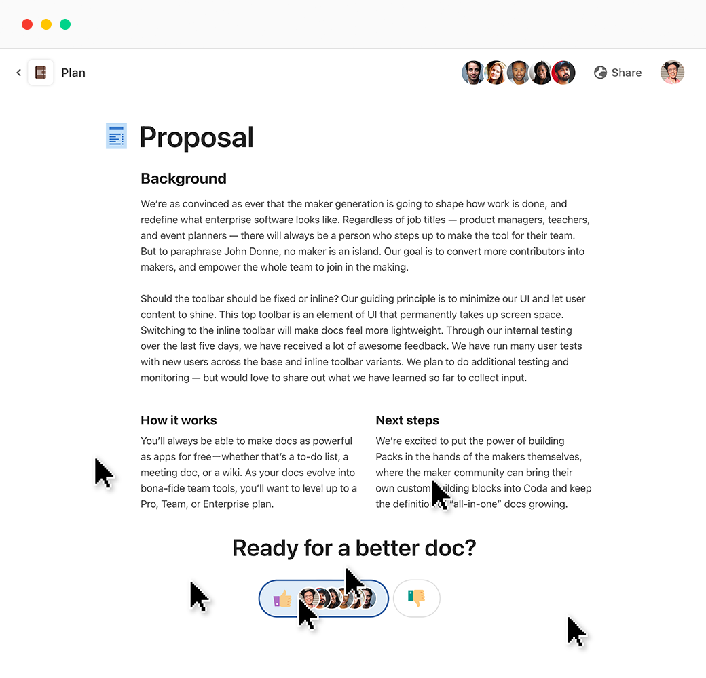{ loading=lazy }

| Criteria     | Value              | Notes |
| ------------ | ------------------ | ----- |
| Sync service | :white_check_mark: |       |
| Linux client | :x:                |       |
| Web client   | :white_check_mark: |       |
| iOS client   | :white_check_mark: |       |

### Craft

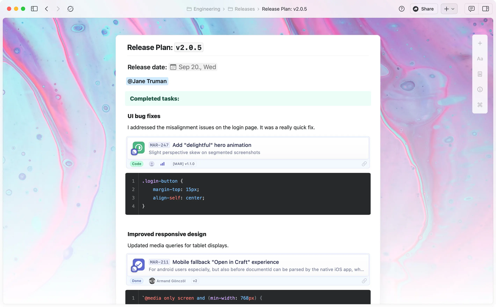{ loading=lazy }

| Criteria     | Value              | Notes |
| ------------ | ------------------ | ----- |
| Sync service | :white_check_mark: |       |
| Linux client | :x:                |       |
| Web client   | :white_check_mark: |       |
| iOS client   | :white_check_mark: |       |

### Taskade

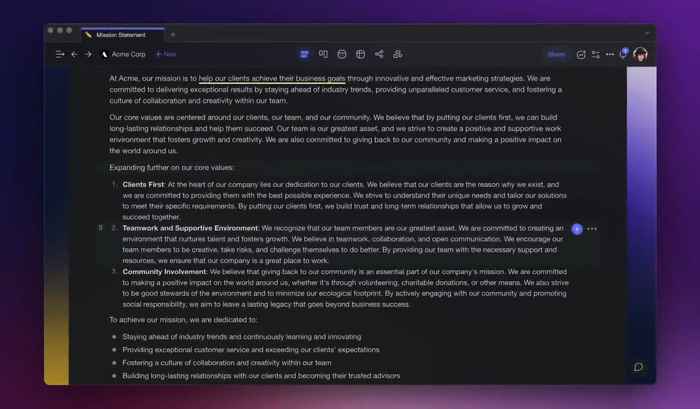{ loading=lazy }

| Criteria     | Value              | Notes |
| ------------ | ------------------ | ----- |
| Sync service | :white_check_mark: |       |
| Linux client | :white_check_mark: |       |
| Web client   | :white_check_mark: |       |
| iOS client   | :white_check_mark: |       |

## Evernote clones

### Nimbus Note

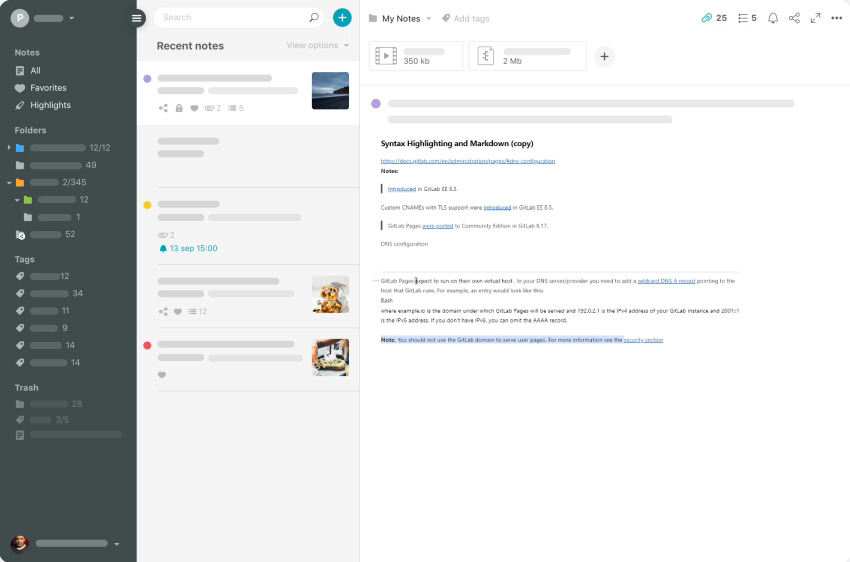{ loading=lazy }

| Criteria     | Value              | Notes |
| ------------ | ------------------ | ----- |
| Sync service | :white_check_mark: |       |
| Linux client | :x:                |       |
| Web client   | :white_check_mark: |       |
| iOS client   | :white_check_mark: |       |

### Notejoy

{ loading=lazy }

| Criteria     | Value              | Notes |
| ------------ | ------------------ | ----- |
| Sync service | :white_check_mark: |       |
| Linux client | :x:                |       |
| Web client   | :white_check_mark: |       |
| iOS client   | :white_check_mark: |       |

### Notesnook

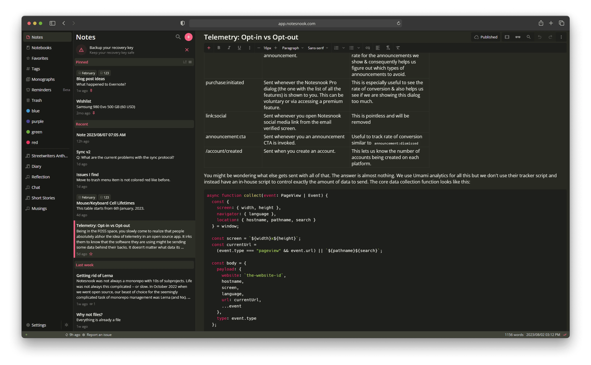{ loading=lazy }

| Criteria     | Value              | Notes |
| ------------ | ------------------ | ----- |
| Sync service | :white_check_mark: |       |
| Linux client | :white_check_mark: |       |
| Web client   | :white_check_mark: |       |
| iOS client   | :white_check_mark: |       |

### Standard Notes

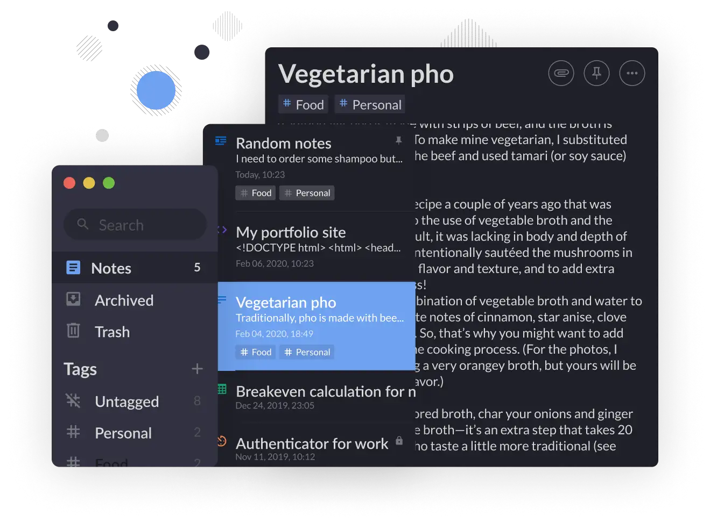{ loading=lazy }

| Criteria     | Value              | Notes |
| ------------ | ------------------ | ----- |
| Sync service | :white_check_mark: |       |
| Linux client | :white_check_mark: |       |
| Web client   | :white_check_mark: |       |
| iOS client   | :white_check_mark: |       |

### Upnote

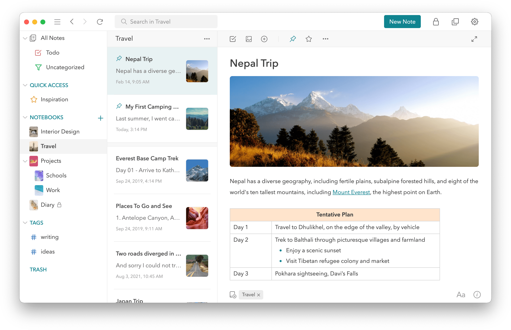{ loading=lazy }

| Criteria     | Value              | Notes |
| ------------ | ------------------ | ----- |
| Sync service | :white_check_mark: |       |
| Linux client | :white_check_mark: |       |
| Web client   | :x:                |       |
| iOS client   | :white_check_mark: |       |

## Apple-only

### Bear

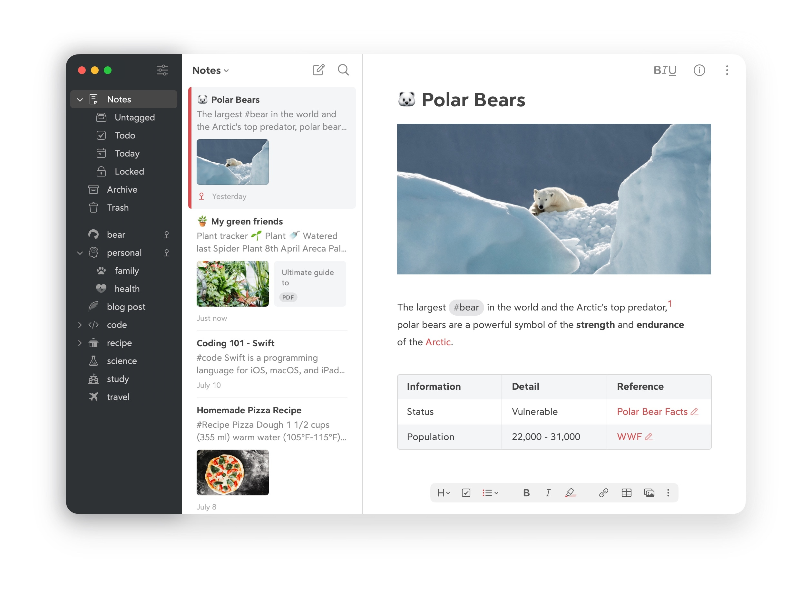{ loading=lazy }

| Criteria     | Value              | Notes |
| ------------ | ------------------ | ----- |
| Sync service | :white_check_mark: |       |
| Linux client | :x:                |       |
| Web client   | :x:                |       |
| iOS client   | :white_check_mark: |       |

### Drafts

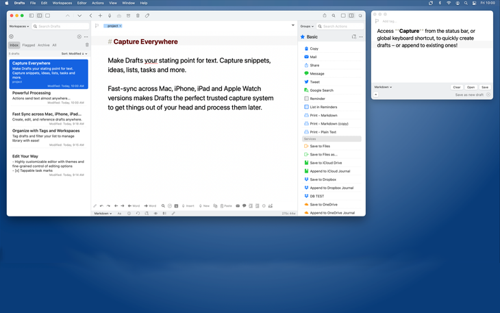{ loading=lazy }

| Criteria     | Value              | Notes |
| ------------ | ------------------ | ----- |
| Sync service | :x:                |       |
| Linux client | :x:                |       |
| Web client   | :x:                |       |
| iOS client   | :white_check_mark: |       |

## TODO

### acreom

| Criteria     | Value              | Notes |
| ------------ | ------------------ | ----- |
| Sync service | :white_check_mark: |       |
| Linux client | :white_check_mark: |       |
| Web client   | :white_check_mark: |       |
| iOS client   | :white_check_mark: |       |

### Amplenote

| Criteria     | Value              | Notes |
| ------------ | ------------------ | ----- |
| Sync service | :white_check_mark: |       |
| Linux client | :x:                |       |
| Web client   | :white_check_mark: |       |
| iOS client   | :white_check_mark: |       |

### Bundled Notes

| Criteria     | Value              | Notes |
| ------------ | ------------------ | ----- |
| Sync service | :x:                |       |
| Linux client | :x:                |       |
| Web client   | :white_check_mark: |       |
| iOS client   | :x:                |       |

### Capacities

| Criteria     | Value              | Notes |
| ------------ | ------------------ | ----- |
| Sync service | :white_check_mark: |       |
| Linux client | :x:                |       |
| Web client   | :white_check_mark: |       |
| iOS client   | :white_check_mark: |       |

### Devonthink

| Criteria     | Value              | Notes |
| ------------ | ------------------ | ----- |
| Sync service | :white_check_mark: |       |
| Linux client | :x:                |       |
| Web client   | :x:                |       |
| iOS client   | :white_check_mark: |       |

### Dropbox Paper

| Criteria     | Value              | Notes |
| ------------ | ------------------ | ----- |
| Sync service | :white_check_mark: |       |
| Linux client | :x:                |       |
| Web client   | :white_check_mark: |       |
| iOS client   | :white_check_mark: |       |

### Dynalist

| Criteria     | Value              | Notes |
| ------------ | ------------------ | ----- |
| Sync service | :white_check_mark: |       |
| Linux client | :white_check_mark: |       |
| Web client   | :white_check_mark: |       |
| iOS client   | :white_check_mark: |       |

### Inkdrop

| Criteria     | Value              | Notes |
| ------------ | ------------------ | ----- |
| Sync service | :white_check_mark: |       |
| Linux client | :white_check_mark: |       |
| Web client   | :x:                |       |
| iOS client   | :white_check_mark: |       |

### Joplin

| Criteria     | Value              | Notes |
| ------------ | ------------------ | ----- |
| Sync service | :white_check_mark: |       |
| Linux client | :white_check_mark: |       |
| Web client   | :x:                |       |
| iOS client   | :white_check_mark: |       |

### Logseq

| Criteria     | Value              | Notes |
| ------------ | ------------------ | ----- |
| Sync service | :white_check_mark: |       |
| Linux client | :white_check_mark: |       |
| Web client   | :x:                |       |
| iOS client   | :white_check_mark: |       |

### Mem

| Criteria     | Value              | Notes |
| ------------ | ------------------ | ----- |
| Sync service | :white_check_mark: |       |
| Linux client | :x:                |       |
| Web client   | :white_check_mark: |       |
| iOS client   | :white_check_mark: |       |

### Notable

| Criteria     | Value              | Notes |
| ------------ | ------------------ | ----- |
| Sync service | :x:                |       |
| Linux client | :white_check_mark: |       |
| Web client   | :x:                |       |
| iOS client   | :x:                |       |

### Obsidian

| Criteria     | Value              | Notes |
| ------------ | ------------------ | ----- |
| Sync service | :white_check_mark: |       |
| Linux client | :white_check_mark: |       |
| Web client   | :x:                |       |
| iOS client   | :white_check_mark: |       |

### Reflect

| Criteria     | Value              | Notes |
| ------------ | ------------------ | ----- |
| Sync service | :white_check_mark: |       |
| Linux client | :x:                |       |
| Web client   | :white_check_mark: |       |
| iOS client   | :white_check_mark: |       |

### Remnote

| Criteria     | Value              | Notes |
| ------------ | ------------------ | ----- |
| Sync service | :white_check_mark: |       |
| Linux client | :white_check_mark: |       |
| Web client   | :white_check_mark: |       |
| iOS client   | :white_check_mark: |       |

### Roam Research

| Criteria     | Value              | Notes |
| ------------ | ------------------ | ----- |
| Sync service | :white_check_mark: |       |
| Linux client | :x:                |       |
| Web client   | :white_check_mark: |       |
| iOS client   | :x:                |       |

### Simplenote

| Criteria     | Value              | Notes |
| ------------ | ------------------ | ----- |
| Sync service | :white_check_mark: |       |
| Linux client | :white_check_mark: |       |
| Web client   | :x:                |       |
| iOS client   | :white_check_mark: |       |

### Supernotes

| Criteria     | Value              | Notes |
| ------------ | ------------------ | ----- |
| Sync service | :white_check_mark: |       |
| Linux client | :white_check_mark: |       |
| Web client   | :white_check_mark: |       |
| iOS client   | :white_check_mark: |       |

### Tana

| Criteria     | Value              | Notes                                |
| ------------ | ------------------ | ------------------------------------ |
| Sync service | :white_check_mark: |                                      |
| Linux client | :x:                |                                      |
| Web client   | :white_check_mark: |                                      |
| iOS client   | :question:         | iOS app exists, but is capture-only. |

### TiddlyWiki

| Criteria     | Value              | Notes |
| ------------ | ------------------ | ----- |
| Sync service | :white_check_mark: |       |
| Linux client | :x:                |       |
| Web client   | :white_check_mark: |       |
| iOS client   | :white_check_mark: |       |

### Workflowy

| Criteria     | Value              | Notes |
| ------------ | ------------------ | ----- |
| Sync service | :white_check_mark: |       |
| Linux client | :white_check_mark: |       |
| Web client   | :white_check_mark: |       |
| iOS client   | :white_check_mark: |       |

### Zettlr

| Criteria     | Value              | Notes |
| ------------ | ------------------ | ----- |
| Sync service | :x:                |       |
| Linux client | :white_check_mark: |       |
| Web client   | :x:                |       |
| iOS client   | :x:                |       |
