I am once again giving into the never-ending temptation to switch up the tools I use, and before so I'm evaluating a massive list of notes options to identify my options, before committing to spending at least a week or two with each one that catches my eye.

<!-- more -->

At least this time, it's a _bit_ more of a necessary switch than previous times. I've been working with a massively inconsistent mismatch of apps for the past couple of years - I've got most stuff in Notion, a bunch of stuff in Logseq, and a bit of stuff in Obsidian, with no consistent rhyme or reason as to why it's split up like this. I want to pick one app and consolidate everything into it, so I'm not constantly switching.

## The Plan

Armed with an absolutely gigantic list of notes apps I assembled a couple of months ago from various places, I spent a few hours across a couple of days going through each one, evaluating it against a set of criteria, and just generally noting my initial thoughts based on things such as their site, screenshots, and community. The main requirements for the notes apps are:

- Sync service
    - I want to be able to access all my notes from any device, without manually syncing them
    - Raw files I can sync using Git is _not_ counted as a sync service - I want something that's fully automatic
- Web client
    - When I say I want to be able to access all my notes from any device, I also want that to include devices I don't have the ability to install arbitrary software on, so a web client is a must
- iOS client
    - Being able to take notes on the go is a must
- Linux client _(optional)_
    - Ideally I'd like to have a desktop client for the notes app, but this is not a hard requirement as long as there is a web client

Once I've gone through all the apps, I selected the few that caught my eye the most, and will be giving each of them a try for a period of time (at least a week or two) to see how they feel to use, and how well they fit into my workflow.

## Household Names

These are the apps that most people have likely heard of, and as a result require the least amount of explanation.

### Apple Notes

{ loading=lazy }

| Criteria     | Value              | Notes |
| ------------ | ------------------ | ----- |
| Sync service | :white_check_mark: |       |
| Linux client | :x:                |       |
| Web client   | :white_check_mark: |       |
| iOS client   | :white_check_mark: |       |

Apple Notes is, I believe, most likely the #1 most used app on this list. It's built into every iPad, iPhone, and Mac on the market, and as a result is incredibly widely used. It's a plenty capable notes app, with support for a wide variety of note content types and is continually being added to with each new Apple event. Unfortunately, the fact it's so Apple-focused means it's not really a great option for me. It does have a web client, but that web client is nowhere near as good as the native client.

### Evernote

{ loading=lazy }

| Criteria     | Value              | Notes                                              |
| ------------ | ------------------ | -------------------------------------------------- |
| Sync service | :white_check_mark: |                                                    |
| Linux client | :question:         | In private beta, minimal details available online. |
| Web client   | :white_check_mark: |                                                    |
| iOS client   | :white_check_mark: |                                                    |

Evernote is _the classic_ notes app. It was wildly popular years ago, but unfortunately with it's waning popularity has come a general implosion of the company. In particular, this year alone, they:

- [Were acquired by Bending Spoons](https://evernote.com/blog/evernote-next-move-joining-bending-spoons), a company with a business model that is largely based around acquiring existing successful companies and absolutely bleeding the product dry
    - For more details on their history of acquisitions & business model, see [this Substack post](https://impassionedmoderate.substack.com/p/ryan-reynolds-didnt-pay-close-enough)
- [Laid off most if not all of their existing employees](https://evernote.com/blog/moving-the-evernote-center-of-operations-to-europe)
- [Jacked up prices by as high as 80%](https://evernote.com/blog/evernote-pricing-upcoming-features-update)

As a result, no matter _how good_ Evernote may be (my understanding is not very, having not innovated for years), I'm not looking at hopping on an obviously sinking ship.

### Google Keep

{ loading=lazy }

| Criteria     | Value              | Notes |
| ------------ | ------------------ | ----- |
| Sync service | :white_check_mark: |       |
| Linux client | :x:                |       |
| Web client   | :white_check_mark: |       |
| iOS client   | :white_check_mark: |       |

Google Keep is Google's answer to Apple Notes. It's simple & clean, great for storing things like a quick note or a shopping list, but not great for anything more complex than that. Additionally, it's a Google product, with a level of care given to it that matches. The [Google Keep website](https://www.google.com/keep/) features screenshots & mockups featuring a Nexus 6 - a phone launched in 2014, and discontinued in 2015. I think it's just a matter of time before Google Keep ends up on [Killed by Google](https://killedbygoogle.com/), like Google Notebook & Google Wave before it.

### Notion

{ loading=lazy }

| Criteria     | Value              | Notes |
| ------------ | ------------------ | ----- |
| Sync service | :white_check_mark: |       |
| Linux client | :x:                |       |
| Web client   | :white_check_mark: |       |
| iOS client   | :white_check_mark: |       |

Notion is my current primary notes app, and also (I believe) the closest thing to a modern Evernote, popularity-wise. It provides a wide variety of embeddable content types, support for arbitrarily-nested notes, and support for advanced features such as databases, letting the user build their own perfect system. If this whole experiment is a failure, I'm probably going to end up just consolidating everything on Notion. It's a bit slow, but on the whole it's a good product with a good pace of updates and a good set of features & UX.

### OneNote

{ loading=lazy }

| Criteria     | Value              | Notes                                                                                                                             |
| ------------ | ------------------ | --------------------------------------------------------------------------------------------------------------------------------- |
| Sync service | :white_check_mark: |                                                                                                                                   |
| Linux client | :x:                |                                                                                                                                   |
| Web client   | :question:         | There was for sure a web client a few years ago, however I'm having trouble navigating the docs to figure out if it still exists. |
| iOS client   | :white_check_mark: |                                                                                                                                   |

This is without a doubt the app on this list I've spent the most time with. Originally launched as a paid companion add-on for the Microsoft Office suite for Microsoft Tablet PCs in Office 2003 and later merged into the main suite in Office 2007, OneNote has since become the defacto notes app for users of Microsoft's Surface line of products. As I used a Surface Pro throughout university for note taking, I've spent _MANY_ hours across several years using OneNote for capturing lecture notes.

It is a quite capable notes app, providing a melding of Evernote-styled UX with Microsoft Office-based text & object options, with a layering of an additional focus of pen input on top of that.
Unfortunately, the Microsoft Office foundations underlying that provide such great options for note content also serve to kneecap one of the most important features of a multi-device notes app - the sync service. OneNote uses OneDrive under the hood for syncing, which already isn't ideal if you're not all-in on the Microsoft 365 ecosystem, but as best as I can tell at least as of last time I used it, they absolutely botched the implementation of it. Syncing is slow and janky, and trying to open OneNote on a new device is always an exercise in patience as you sit and wait _minutes_ for it to try and pull down your existing notebooks, no matter how empty the notebooks are. Seemingly even just an empty 100KB notebook in your account is enough to have you to deal with this.

If I were looking for something to use with a pen on my Surface Pro, I'd pick this up again without a second thought, but I'm not.

## Handwritten / Canvas-based

These are apps that are focused more on handwritten notes or a canvas-based approach to laying out notes, which does not interest me. As a result, these are all off the table immediately.

### GoodNotes

{ loading=lazy }

| Criteria     | Value              | Notes |
| ------------ | ------------------ | ----- |
| Sync service | :white_check_mark: |       |
| Linux client | :x:                |       |
| Web client   | :x:                |       |
| iOS client   | :white_check_mark: |       |

GoodNotes is one of the main written notes apps for the iPad. I've used it for a bit and it's a fantastic option if you're looking for a written notes app - in particular, the fact it allows you to pay a one-time payment instead of a subscription, unlike Notability, is much appreciated. It's got all the usual features you'd expect from a written notes app, such as support for multiple pen types, support for typed text, and support for importing PDFs to annotate, but at it's core it is built for handwritten notes and so is not what I'm looking for.

### Milanote

{ loading=lazy }

| Criteria     | Value              | Notes |
| ------------ | ------------------ | ----- |
| Sync service | :white_check_mark: |       |
| Linux client | :x:                |       |
| Web client   | :white_check_mark: |       |
| iOS client   | :white_check_mark: |       |

Milanote is an app that is very much designed for more visual work. It has a heavy emphasis on a canvas-based approach to laying out notes, and I think it'd be a fantastic choice if you're looking to capture and collaborate on ideas for something design-focused, but the app is just not designed for working on large amounts of text-based notes, for things like technical projects with no visual component.

### Notability

{ loading=lazy }

| Criteria     | Value              | Notes |
| ------------ | ------------------ | ----- |
| Sync service | :white_check_mark: |       |
| Linux client | :x:                |       |
| Web client   | :x:                |       |
| iOS client   | :white_check_mark: |       |

Notability is (in my mind) the primary counterpart of GoodNotes. It has much the same feature set, with from my perspective the only real difference being the fact that it requires a subscription instead of a one-time payment. Since it's basically the same thing as GoodNotes, it is off the table for the same reason.

### Scrintal

{ loading=lazy }

| Criteria     | Value              | Notes |
| ------------ | ------------------ | ----- |
| Sync service | :white_check_mark: |       |
| Linux client | :x:                |       |
| Web client   | :white_check_mark: |       |
| iOS client   | :x:                |       |

Scrintal is quite similar to Milanote, with a focus on creating many small notes and laying them out on a large canvas alongside images and other media. It seems to be a bit more text-focused than Milanote (just comparing the images of the two should be enough to make that clear), but it is still very much designed around laying out notes visually, which I am not looking for.

## How Did We Get Here?

I will readily admit - I have absolutely zero memory of where I sourced / collected this list of note apps from. As a result, there are some items on this list that make absolutely _zero_ sense to me. This is the catch-all category for anything that made me just ask myself how it ended up here.

### Asana

{ loading=lazy }

| Criteria     | Value              | Notes |
| ------------ | ------------------ | ----- |
| Sync service | :white_check_mark: |       |
| Linux client | :x:                |       |
| Web client   | :white_check_mark: |       |
| iOS client   | :white_check_mark: |       |

Asana is a project / task management app for teams, akin to something like Jira. As far as I can tell, the closest thing it has to notes is comments & descriptions on tasks and projects, which is very much not a notes solution I want to use.

### ClickUp

{ loading=lazy }

| Criteria     | Value              | Notes |
| ------------ | ------------------ | ----- |
| Sync service | :white_check_mark: |       |
| Linux client | :white_check_mark: |       |
| Web client   | :white_check_mark: |       |
| iOS client   | :white_check_mark: |       |

ClickUp is, much like Asana, an app primarily built for project / task management. It _does_ have an actual place to do writing, unlike Asana, in the form of it's Docs feature, but I'm not looking for a docs solution attached to an app primarily built for project management. I will note however that the Docs do look to be pretty nice, and they sound like they may be well integrated, so I suspect if you're already using ClickUp the docs might be a fantastic alternative to Notion, but I don't think they're worth adopting ClickUp for.

### Clutter

{ loading=lazy width=400 }

| Criteria     | Value | Notes |
| ------------ | ----- | ----- |
| Sync service | :x:   |       |
| Linux client | :x:   |       |
| Web client   | :x:   |       |
| iOS client   | :x:   |       |

Clutter is the only app on this list I struggled to find any trace of. As far as I can find, it consists of a very rudimentary Android app that hasn't been updated in a very long time, and a website that may have originally been associated / contained an actual app, but these days just contains a newsletter signup, with the rest of the viewport filled with misc. unrelated ads.

<figure markdown>
  { loading=lazy }
  <figcaption>Clutter Notes site</figcaption>
</figure>

### OmniFocus

{ loading=lazy }

| Criteria     | Value              | Notes |
| ------------ | ------------------ | ----- |
| Sync service | :white_check_mark: |       |
| Linux client | :x:                |       |
| Web client   | :white_check_mark: |       |
| iOS client   | :white_check_mark: |       |

OmniFocus is a task / project management app for Apple devices. I've heard fantastic things about it from folks online (mainly CGP Grey), and I may look at giving it a chance if I ever go all-in on the Apple ecosystem again, but it's not a notes app.

### Remnote

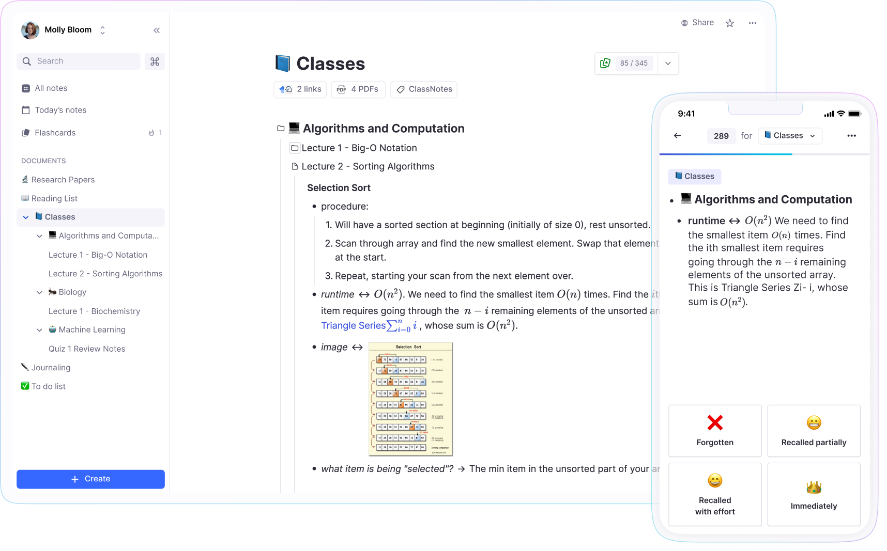{ loading=lazy }

| Criteria     | Value              | Notes |
| ------------ | ------------------ | ----- |
| Sync service | :white_check_mark: |       |
| Linux client | :white_check_mark: |       |
| Web client   | :white_check_mark: |       |
| iOS client   | :white_check_mark: |       |

Remnote is a notes app very much focused on taking notes for school. As a result, most of its features are focused on this, such as things like flashcards. I think it may be a fantastic app if you are a student, but for technical note taking this is very much not fit for my needs.

### Things

{ loading=lazy }

| Criteria     | Value              | Notes |
| ------------ | ------------------ | ----- |
| Sync service | :white_check_mark: |       |
| Linux client | :x:                |       |
| Web client   | :x:                |       |
| iOS client   | :white_check_mark: |       |

Similar to OmniFocus, Things is an Apple-only todo app. It's supposedly a fantastic todo app, but it's not a notes app.

## Evernote clones

Evernote is the classic example of a super successful notes app, and so it is no surprise that it has plenty of clones. These apps are categorized not based on being a direct clone / advertized replacement for Evernote, but rather based on having a workflow very reminiscent of Evernote.

That workflow is:

- A single, flat list of notes
- Each note is a single page
- Notes can be grouped using tags
- Notes can be grouped into notebooks

### Amplenote

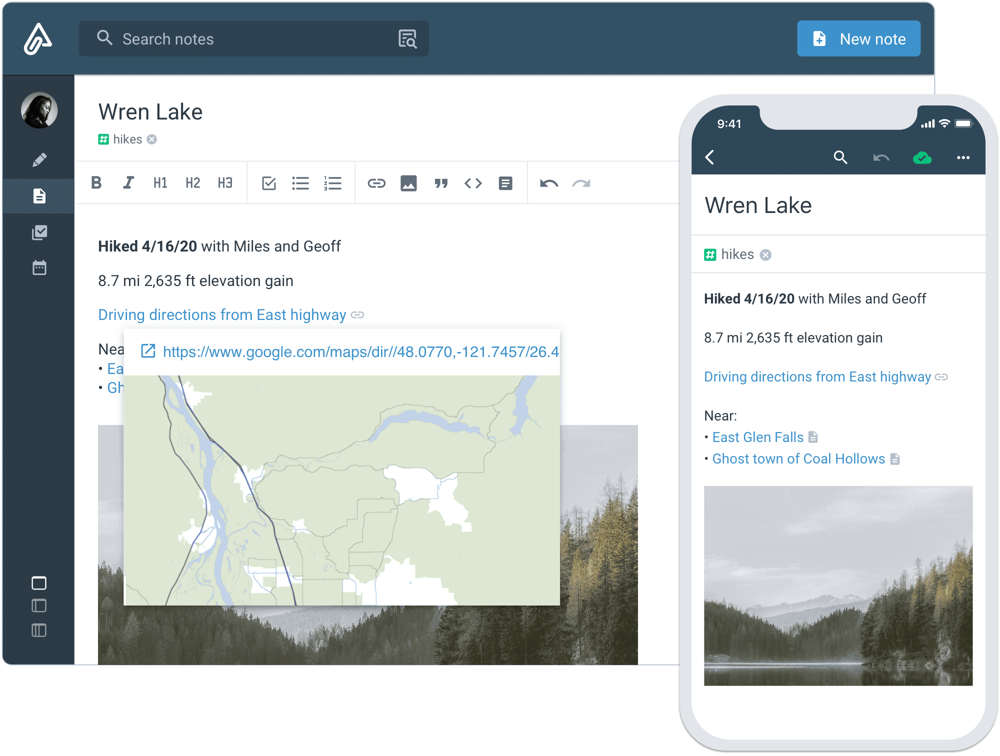{ loading=lazy }

| Criteria     | Value              | Notes |
| ------------ | ------------------ | ----- |
| Sync service | :white_check_mark: |       |
| Linux client | :x:                |       |
| Web client   | :white_check_mark: |       |
| iOS client   | :white_check_mark: |       |

Amplenote seems to be a bit of a kitchen sink-type app. It advertises competing with Evernote, Roam Research, Todoist, and Google Calendar. They seem to have implemented basically any possible idea they thought of, and I worry that everything is stretched a bit thin and half-baked as a result. Unfortunately, it is (in my opinion) a bit lacking from the UI design perspective - the UI gives heavy 2012 WordPress admin page vibes. One place that this app does win is when it comes to likely longevity - they've advertised that the company is entirely self-funded, and has no investors, meaning they're not going to be forced by the investors to make decisions to improve the investors returns at the cost of users.

### Inkdrop

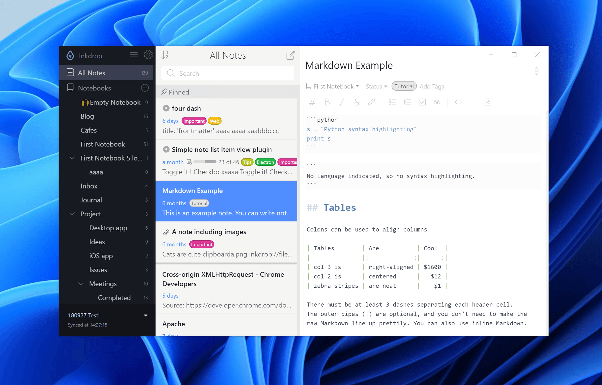{ loading=lazy }

| Criteria     | Value              | Notes |
| ------------ | ------------------ | ----- |
| Sync service | :white_check_mark: |       |
| Linux client | :white_check_mark: |       |
| Web client   | :x:                |       |
| iOS client   | :white_check_mark: |       |

Inkdrop belongs to the category of Markdown-based notes apps. It features a very Evernote-like feature set, but with the key distinction being that notes are authored & stored in plain Markdown, which is then rendered as rich text. This is a setup that I am a fan of, and I actually was a regular user of Inkdrop for a while, but unforunately Inkdrop lacks a web app at this point, which is a deal-breaker for me. This is a shame, because Inkdrop actually has something massive going for it - back when I was an Inkdrop user I ported the Material Palenight colour scheme to Inkdrop, and as a result when Christmas came the developer gave me a permanent "Plugin Developer Discount", which gives me Inkdrop for free, permanently.

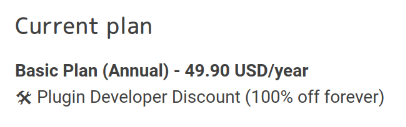{ loading=lazy }

### Joplin

{ loading=lazy }

| Criteria     | Value              | Notes |
| ------------ | ------------------ | ----- |
| Sync service | :white_check_mark: |       |
| Linux client | :white_check_mark: |       |
| Web client   | :x:                |       |
| iOS client   | :white_check_mark: |       |

### Nimbus Note

{ loading=lazy }

| Criteria     | Value              | Notes |
| ------------ | ------------------ | ----- |
| Sync service | :white_check_mark: |       |
| Linux client | :x:                |       |
| Web client   | :white_check_mark: |       |
| iOS client   | :white_check_mark: |       |

### Notable

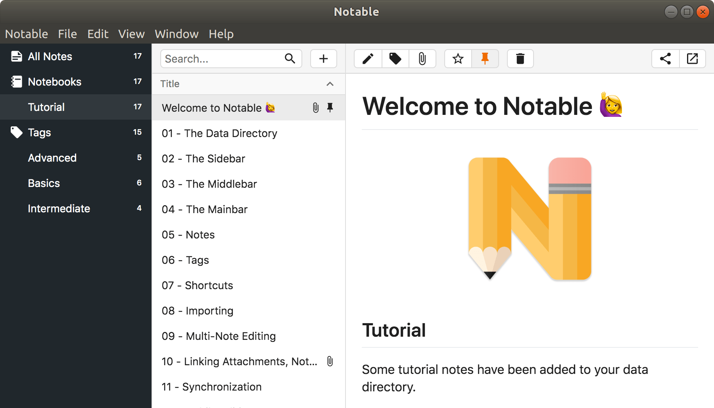{ loading=lazy }

| Criteria     | Value              | Notes |
| ------------ | ------------------ | ----- |
| Sync service | :x:                |       |
| Linux client | :white_check_mark: |       |
| Web client   | :x:                |       |
| iOS client   | :x:                |       |

### Notejoy

{ loading=lazy }

| Criteria     | Value              | Notes |
| ------------ | ------------------ | ----- |
| Sync service | :white_check_mark: |       |
| Linux client | :x:                |       |
| Web client   | :white_check_mark: |       |
| iOS client   | :white_check_mark: |       |

### Notesnook

{ loading=lazy }

| Criteria     | Value              | Notes |
| ------------ | ------------------ | ----- |
| Sync service | :white_check_mark: |       |
| Linux client | :white_check_mark: |       |
| Web client   | :white_check_mark: |       |
| iOS client   | :white_check_mark: |       |

### Simplenote

{ loading=lazy }

| Criteria     | Value              | Notes |
| ------------ | ------------------ | ----- |
| Sync service | :white_check_mark: |       |
| Linux client | :white_check_mark: |       |
| Web client   | :x:                |       |
| iOS client   | :white_check_mark: |       |

### Standard Notes

{ loading=lazy }

| Criteria     | Value              | Notes |
| ------------ | ------------------ | ----- |
| Sync service | :white_check_mark: |       |
| Linux client | :white_check_mark: |       |
| Web client   | :white_check_mark: |       |
| iOS client   | :white_check_mark: |       |

### Upnote

{ loading=lazy }

| Criteria     | Value              | Notes |
| ------------ | ------------------ | ----- |
| Sync service | :white_check_mark: |       |
| Linux client | :white_check_mark: |       |
| Web client   | :x:                |       |
| iOS client   | :white_check_mark: |       |

## Notion clones

Notion is (in my opinion) the closest thing to Evernote when it comes to level of popularity compared to Evernote's peak. As a result, it has obviously had wide-reaching influence on the notes app space, and so there are plenty of apps out there trying to take a chunk of Notion's market share. As with the Evernote clones, these are not necessarily direct clones of Notion, but rather apps that have a workflow very reminiscent of Notion.

That workflow is:

- Notes are pages
- Pages can contain other pages, leading to a much more customizable, user-defined organization hierarchy
- Pages contain "blocks" of content of various types, such as text, lists, tables, etc.

### Anytype

{ loading=lazy }

| Criteria     | Value              | Notes |
| ------------ | ------------------ | ----- |
| Sync service | :white_check_mark: |       |
| Linux client | :white_check_mark: |       |
| Web client   | :x:                |       |
| iOS client   | :white_check_mark: |       |

### Coda

{ loading=lazy }

| Criteria     | Value              | Notes |
| ------------ | ------------------ | ----- |
| Sync service | :white_check_mark: |       |
| Linux client | :x:                |       |
| Web client   | :white_check_mark: |       |
| iOS client   | :white_check_mark: |       |

### Craft

{ loading=lazy }

| Criteria     | Value              | Notes |
| ------------ | ------------------ | ----- |
| Sync service | :white_check_mark: |       |
| Linux client | :x:                |       |
| Web client   | :white_check_mark: |       |
| iOS client   | :white_check_mark: |       |

### Dropbox Paper

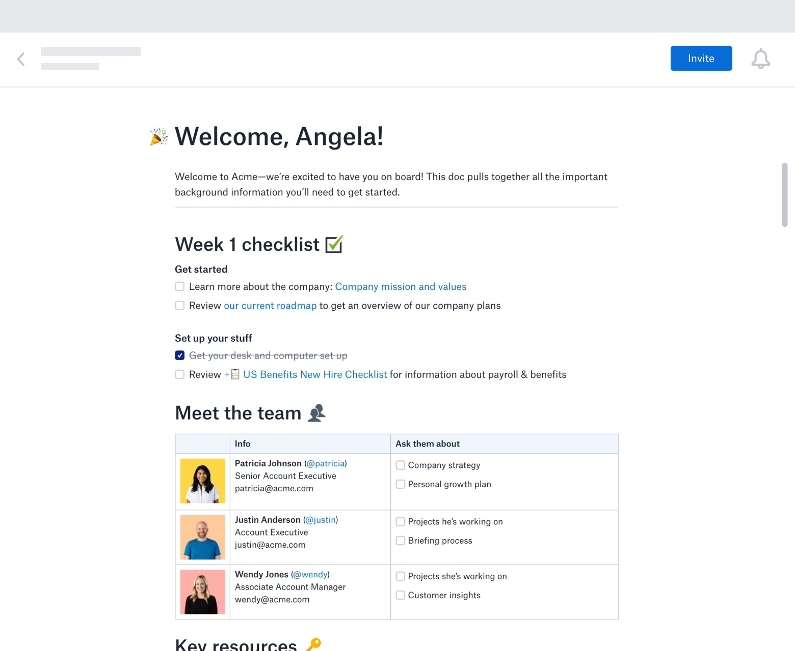{ loading=lazy }

| Criteria     | Value              | Notes |
| ------------ | ------------------ | ----- |
| Sync service | :white_check_mark: |       |
| Linux client | :x:                |       |
| Web client   | :white_check_mark: |       |
| iOS client   | :white_check_mark: |       |

## Apple-only

If I were doing this research a year ago, these apps would be in the running, but due to my personal machine no longer being a Mac, these are all off the table.

### Bear

{ loading=lazy }

| Criteria     | Value              | Notes |
| ------------ | ------------------ | ----- |
| Sync service | :white_check_mark: |       |
| Linux client | :x:                |       |
| Web client   | :x:                |       |
| iOS client   | :white_check_mark: |       |

### DEVONthink

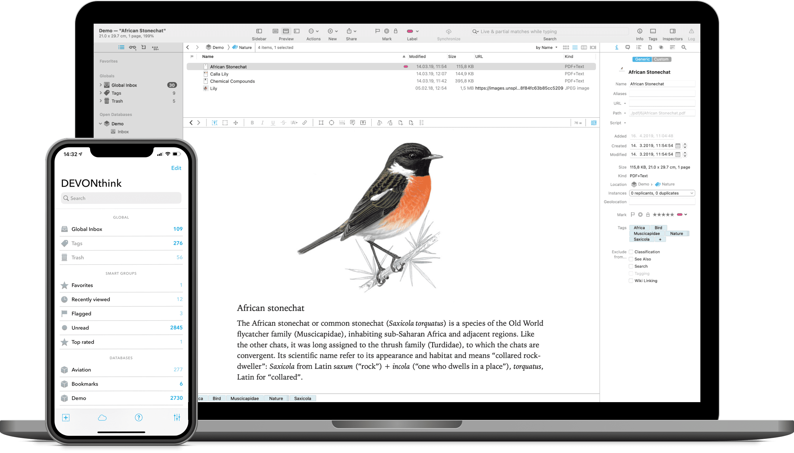{ loading=lazy }

| Criteria     | Value              | Notes |
| ------------ | ------------------ | ----- |
| Sync service | :white_check_mark: |       |
| Linux client | :x:                |       |
| Web client   | :x:                |       |
| iOS client   | :white_check_mark: |       |

### Drafts

{ loading=lazy }

| Criteria     | Value              | Notes |
| ------------ | ------------------ | ----- |
| Sync service | :x:                |       |
| Linux client | :x:                |       |
| Web client   | :x:                |       |
| iOS client   | :white_check_mark: |       |

## Chasing the New Hot Thing™

These are the apps who have made their whole design / business-model around the current hot thing - AI - to the point of (at least from the perspective of someone who knows nothing about the app) making it near impossible to find out what the app actually does or how it works.

### Mem

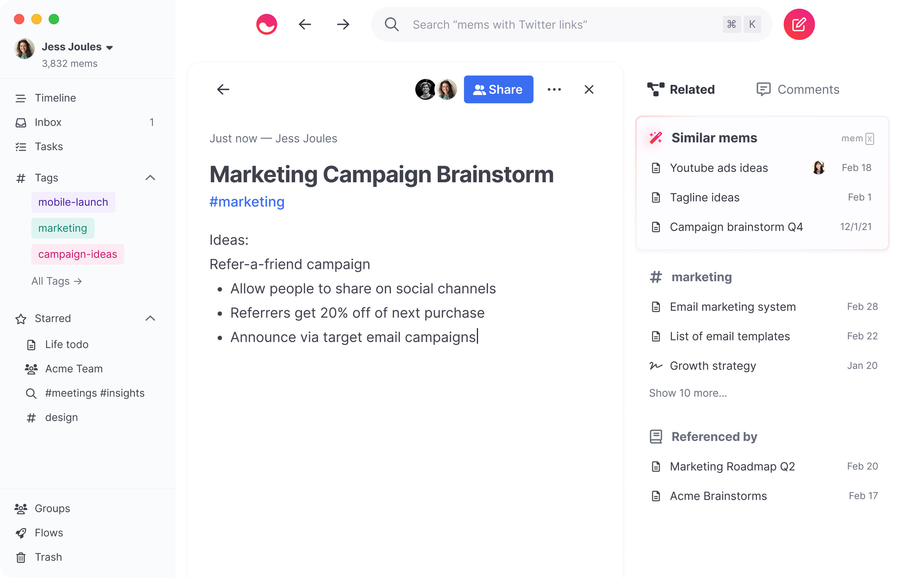{ loading=lazy }

| Criteria     | Value              | Notes |
| ------------ | ------------------ | ----- |
| Sync service | :white_check_mark: |       |
| Linux client | :x:                |       |
| Web client   | :white_check_mark: |       |
| iOS client   | :white_check_mark: |       |

Mem appears to have originally been a Notion-like app, but since the AI craze kicked off they seem to have gone ALL IN on AI. Their main site is like 75% AI mentions, 25% actual note taking app mentions. The note taking / document writing functionality seems to now largely just be a means of getting data into and out of their AI.

### Taskade

{ loading=lazy }

| Criteria     | Value              | Notes |
| ------------ | ------------------ | ----- |
| Sync service | :white_check_mark: |       |
| Linux client | :white_check_mark: |       |
| Web client   | :white_check_mark: |       |
| iOS client   | :white_check_mark: |       |

Taskade appears to also be a Notion-like app, but is now fully all-in on AI. Scrolling through the main product page, I see:

- AI
- AI
- AI
- AI
- Graph view
- AI
- Sharing
- Collaboration
- Zoom competitor?
- 3x4 grid where all items are AI

Basically everything on this site is all focused on the AI functionality. I don't mind a bit of AI functionality, but the sheer amount of focus on it on this site makes me think they're just chasing the current trend and might be neglecting the core functionality in favour of that.

Also, any time I load their site it lags my whole computer and causes my fans to spin up, so that doesn't exactly instil confidence about the performance of the app itself, if just their marketing site is enough to do this.

## Graph-based

Popularized by Roam Research, graph-based / Zettelkasten Method-inspired notes apps have experienced a massive surge in popularity and, as a result, a surge in the number of options. These are the apps that are focused on this workflow.

### Capacities

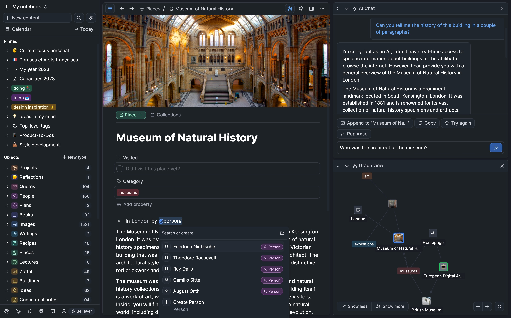{ loading=lazy }

| Criteria     | Value              | Notes |
| ------------ | ------------------ | ----- |
| Sync service | :white_check_mark: |       |
| Linux client | :x:                |       |
| Web client   | :white_check_mark: |       |
| iOS client   | :white_check_mark: |       |

### Logseq

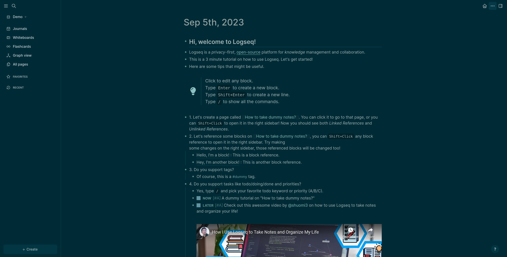{ loading=lazy }

| Criteria     | Value              | Notes |
| ------------ | ------------------ | ----- |
| Sync service | :white_check_mark: |       |
| Linux client | :white_check_mark: |       |
| Web client   | :x:                |       |
| iOS client   | :white_check_mark: |       |

### Obsidian

{ loading=lazy }

| Criteria     | Value              | Notes |
| ------------ | ------------------ | ----- |
| Sync service | :white_check_mark: |       |
| Linux client | :white_check_mark: |       |
| Web client   | :x:                |       |
| iOS client   | :white_check_mark: |       |

### Reflect

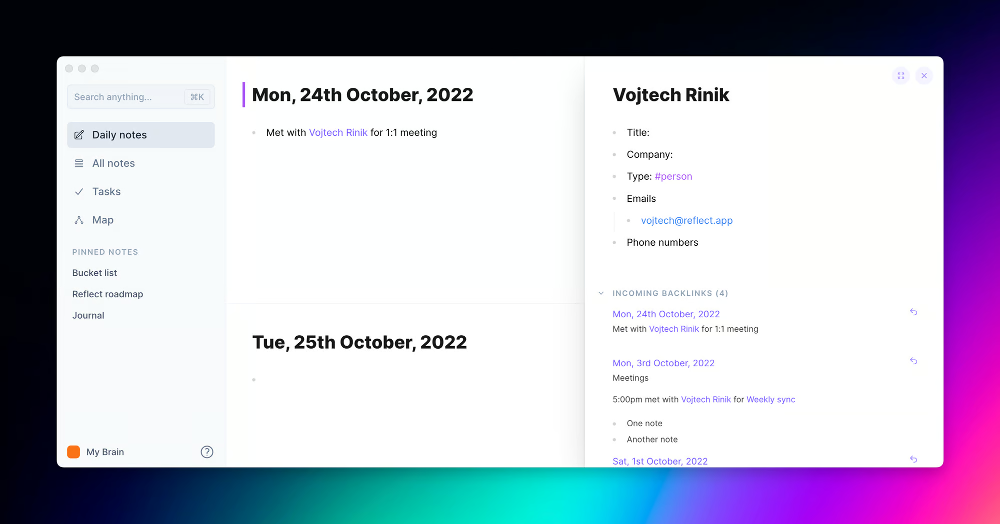{ loading=lazy }

| Criteria     | Value              | Notes |
| ------------ | ------------------ | ----- |
| Sync service | :white_check_mark: |       |
| Linux client | :x:                |       |
| Web client   | :white_check_mark: |       |
| iOS client   | :white_check_mark: |       |

### Roam Research

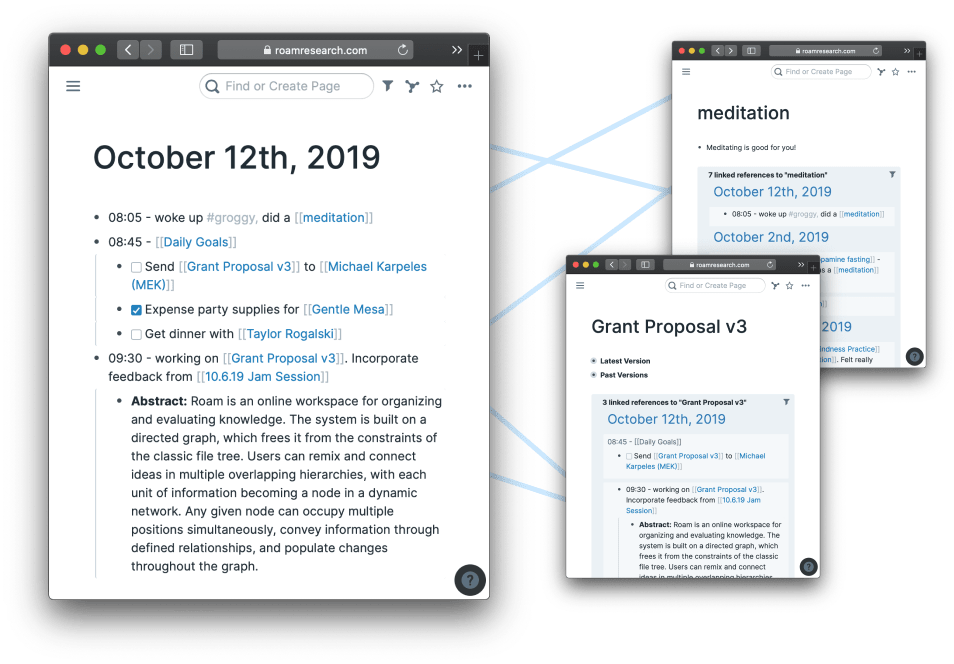{ loading=lazy }

| Criteria     | Value              | Notes                              |
| ------------ | ------------------ | ---------------------------------- |
| Sync service | :white_check_mark: |                                    |
| Linux client | :x:                |                                    |
| Web client   | :white_check_mark: |                                    |
| iOS client   | :question:         | Exists, but is not fully-featured. |

### Supernotes

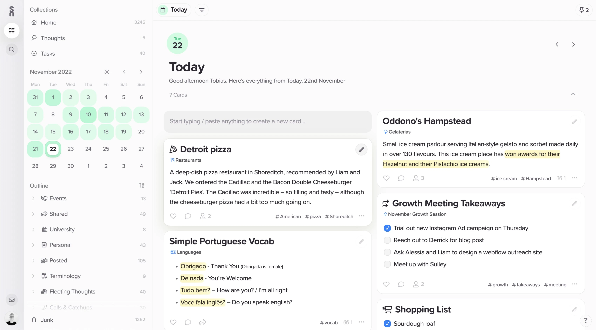{ loading=lazy }

| Criteria     | Value              | Notes |
| ------------ | ------------------ | ----- |
| Sync service | :white_check_mark: |       |
| Linux client | :white_check_mark: |       |
| Web client   | :white_check_mark: |       |
| iOS client   | :white_check_mark: |       |

### Tana

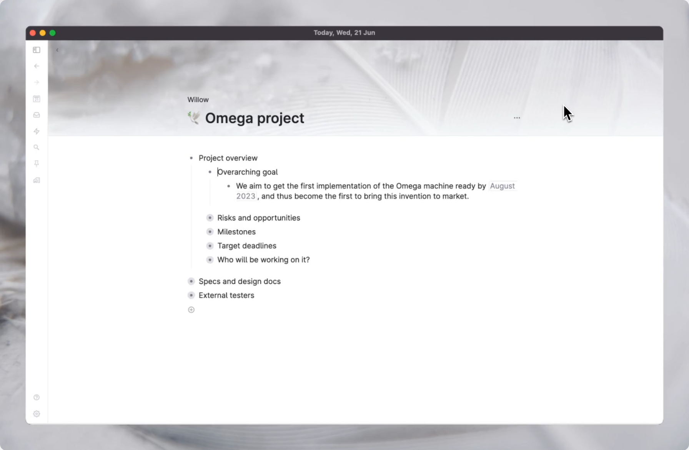{ loading=lazy }

| Criteria     | Value              | Notes                                |
| ------------ | ------------------ | ------------------------------------ |
| Sync service | :white_check_mark: |                                      |
| Linux client | :white_check_mark: |                                      |
| Web client   | :white_check_mark: |                                      |
| iOS client   | :question:         | iOS app exists, but is capture-only. |

### TiddlyWiki

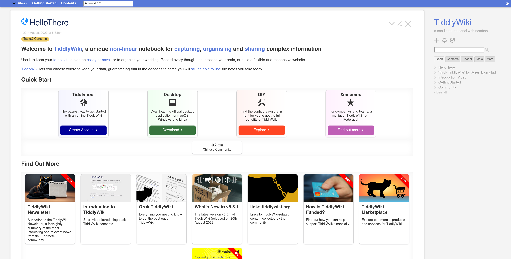{ loading=lazy }

| Criteria     | Value              | Notes |
| ------------ | ------------------ | ----- |
| Sync service | :white_check_mark: |       |
| Linux client | :x:                |       |
| Web client   | :white_check_mark: |       |
| iOS client   | :white_check_mark: |       |

### Zettlr

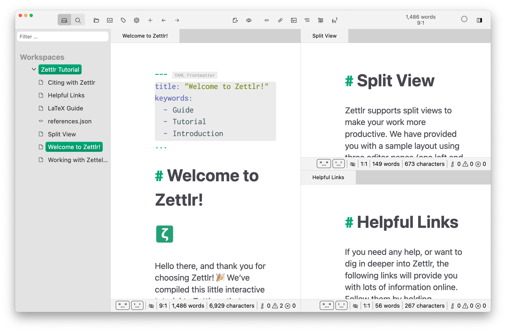{ loading=lazy }

| Criteria     | Value              | Notes |
| ------------ | ------------------ | ----- |
| Sync service | :x:                |       |
| Linux client | :white_check_mark: |       |
| Web client   | :x:                |       |
| iOS client   | :x:                |       |

## Other

These are the apps that don't really fit into any other category.

### acreom

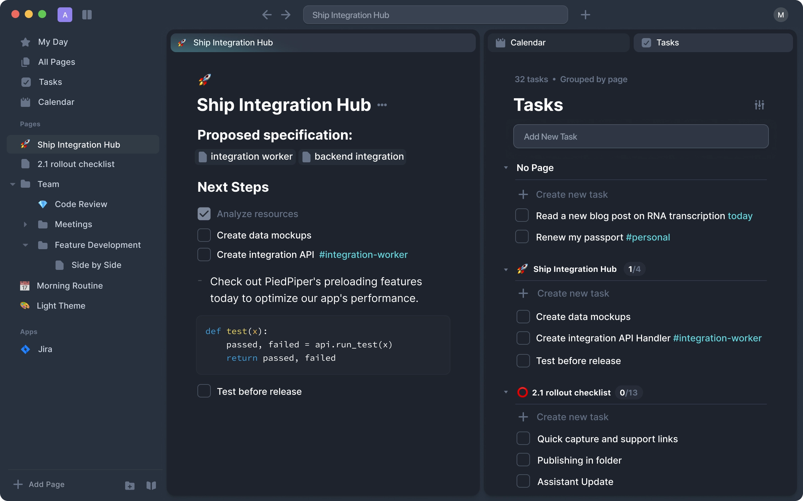{ loading=lazy }

| Criteria     | Value              | Notes |
| ------------ | ------------------ | ----- |
| Sync service | :white_check_mark: |       |
| Linux client | :white_check_mark: |       |
| Web client   | :white_check_mark: |       |
| iOS client   | :white_check_mark: |       |

### Bundled Notes

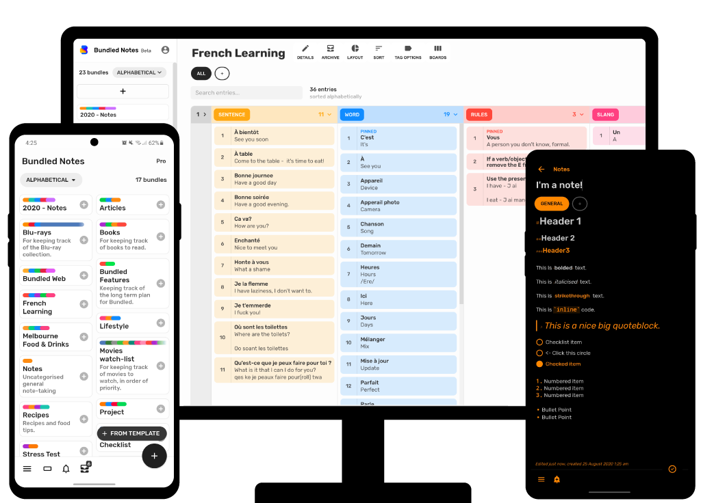{ loading=lazy }

| Criteria     | Value              | Notes |
| ------------ | ------------------ | ----- |
| Sync service | :x:                |       |
| Linux client | :x:                |       |
| Web client   | :white_check_mark: |       |
| iOS client   | :x:                |       |

### Dynalist

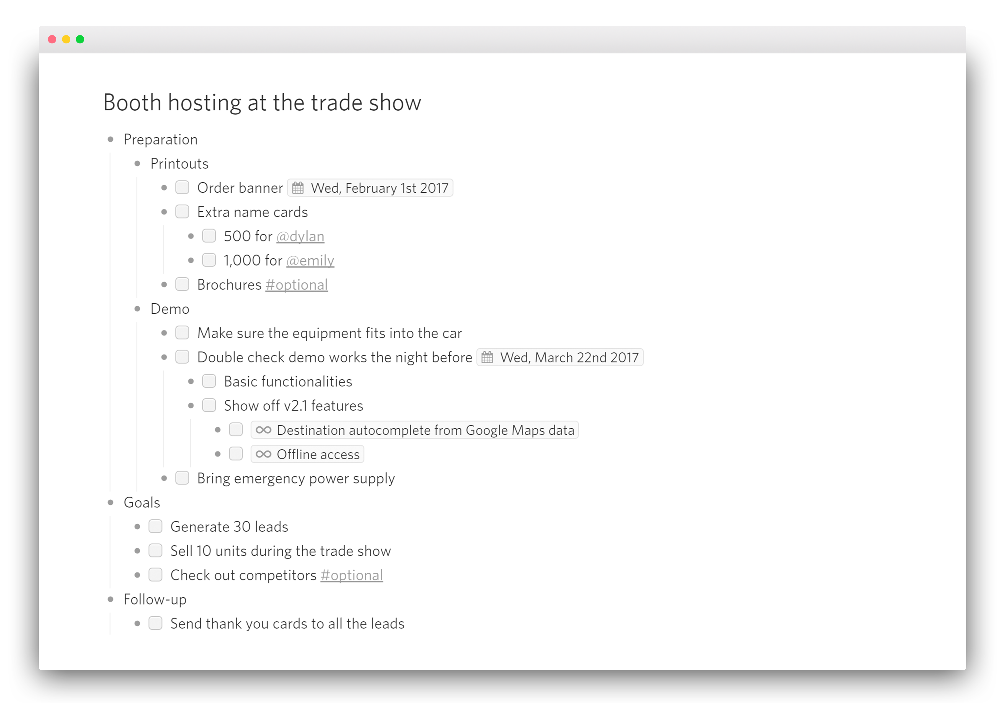{ loading=lazy }

| Criteria     | Value              | Notes |
| ------------ | ------------------ | ----- |
| Sync service | :white_check_mark: |       |
| Linux client | :white_check_mark: |       |
| Web client   | :white_check_mark: |       |
| iOS client   | :white_check_mark: |       |

### Workflowy

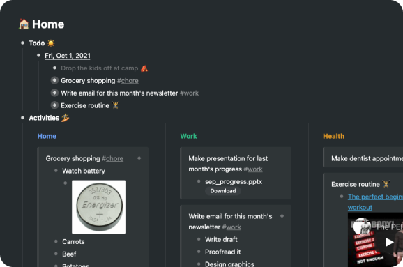{ loading=lazy }

| Criteria     | Value              | Notes |
| ------------ | ------------------ | ----- |
| Sync service | :white_check_mark: |       |
| Linux client | :white_check_mark: |       |
| Web client   | :white_check_mark: |       |
| iOS client   | :white_check_mark: |       |
