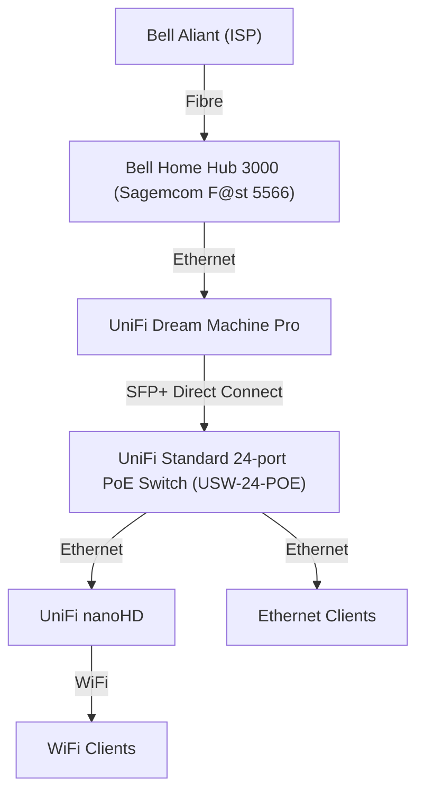

The following devices are powering the network for my homelab:

| Device                                         | Usage                                                                                                                         |
| ---------------------------------------------- | ----------------------------------------------------------------------------------------------------------------------------- |
| Bell Home Hub 3000 (Sagemcom F@st 5566)        | ISP-provided modem & router. Currently used to convert the incoming fibre line into ethernet for use with downstream devices. |
| UniFi Dream Machine Pro                        | Router & UniFi controller.                                                                                                    |
| UniFi nanoHD                                   | Wireless access point.                                                                                                        |
| UniFi Standard 24-port PoE Switch (USW-24-POE) | Switch for all ethernet devices.                                                                                              |

